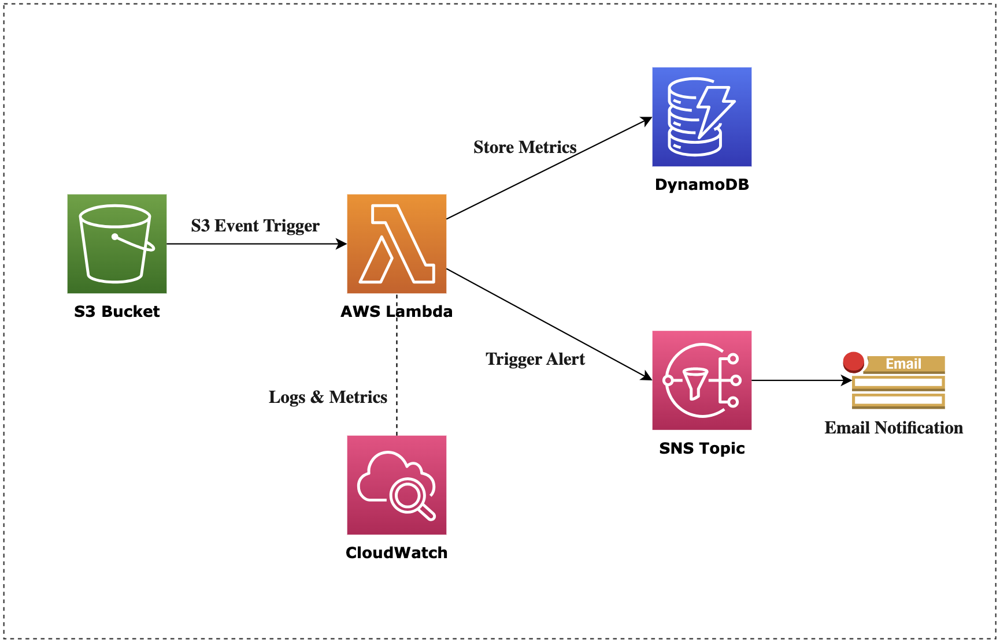

# Bose Predictive Maintenance System

## Project Overview

The **Bose Predictive Maintenance System** is a serverless solution built using **AWS** services to enhance the reliability of Bose products. The system provides real-time monitoring, predictive maintenance alerts, and anomaly detection to proactively identify potential issues.

## Key Features

- **Real-Time Processing**: Processes device health data in near real-time for prompt issue detection.
- **Anomaly Detection**: Identifies deviations in device health metrics to predict and prevent failures.
- **Scalable Serverless Architecture**: Uses AWS services to ensure scalability, cost-effectiveness, and efficient resource management.
- **Infrastructure as Code**: Manages the infrastructure using AWS CloudFormation for easy deployment and reproducibility.
- **Automated Alerts**: Sends notifications through Amazon SNS to inform the maintenance team of potential issues.

## Technologies Used

- **AWS Services**: S3, Lambda, DynamoDB, SNS, CloudWatch
- **Programming Language**: Python 3.10
- **Infrastructure as Code**: AWS CloudFormation YAML

## System Architecture

### Architecture Diagram



### Component Overview

The system consists of the following layers and components:

1. **Data Ingestion Layer**:
   - **Amazon S3**: Stores incoming device health data in the form of raw JSON files.

2. **Data Processing Layer**:
   - **AWS Lambda**: Processes the health data in near real-time, performs anomaly detection, and manages data transformations.

3. **Storage Layer**:
   - **Amazon DynamoDB**: Stores processed health metrics for quick retrieval.
   - **Amazon S3 (Processed Data)**: Archives processed data for long-term retention and analysis.

4. **Notification Layer**:
   - **Amazon SNS**: Sends maintenance alerts to designated recipients when anomalies are detected.

5. **Monitoring and Logging Layer**:
   - **Amazon CloudWatch**: Tracks system metrics, logs key events, and raises alarms for critical incidents.

### Data Flow

1. **Raw health data** is uploaded to the S3 bucket.
2. An **S3 event** triggers the Lambda function.
3. The **Lambda function**:
   - Retrieves data from S3, validates, and processes it.
   - Stores metrics in DynamoDB.
   - Archives processed data in S3 if required.
   - Sends notifications via SNS when potential issues are identified.
4. **CloudWatch** logs the events and provides system metrics for monitoring.

## Getting Started

To set up the Bose Predictive Maintenance System in your own environment:

1. **Clone this repository** to your local machine.
2. **Deploy the S3 bucket** by running the provided script:
   ```
   bash scripts/deploy_s3_bucket.sh
   ```
3. **Deploy the CloudFormation stack** to set up the necessary AWS resources:
   ```
   bash scripts/deploy_main_stack.sh
   ```
4. **Configure environment variables** for your Lambda function as needed.

## How to Use

1. **Upload health data** under test_data folder to the designated S3 bucket in JSON format for different cases.
2. The **Lambda function** will be triggered automatically to process the data.
3. **Metrics** will be available in DynamoDB for further querying, and alerts will be sent via SNS if anomalies are detected.
4. **Monitor system performance** and logs through Amazon CloudWatch for further insights and debugging.

## Outcomes and Impact

- **Reduced Response Time**: Enabled faster detection of anomalies, leading to a simulated 30% reduction in fault response time.
- **Improved Product Insights**: Data analysis provided insights that could be used for improving product performance and reliability.
- **Predictive Maintenance Accuracy**: Leveraged historical data to enhance predictive model accuracy, preventing potential failures before they occur.

## License

This project is licensed under the MIT License. See the [LICENSE](LICENSE) file for details.

## Contact

For questions or inquiries, please contact:

- **Name**: Shuolin Hu
- **Title**: AWS Data Engineer
- **Email**: shuolin96@gmail.com
- **Linkedln**: https://www.linkedin.com/in/shuolinhu/
